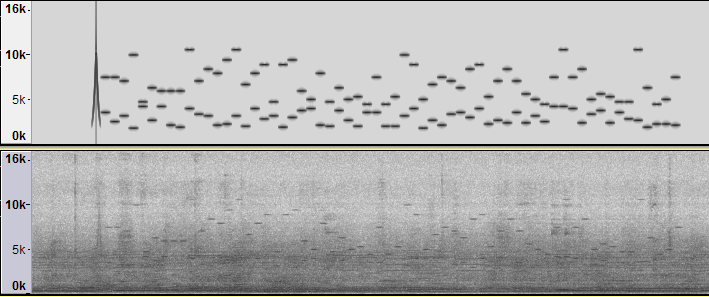

# OpenWarble

](https://travis-ci.org/nicolas-f/openwarble)

Broadcast your data using sound pitches.

This library is written in C99 under BSD 3 license.

This library use the library [libcorrect](https://github.com/quiet/libcorrect) for forward error correction.

Signal processing use method *Sysel and Rajmic:Goertzel algorithm generalized to non-integer multiples of fundamental frequency. EURASIP Journal on Advances in Signal Processing 2012 2012:56.*

# How it works ?

The data is converted into a sequence of tones. The first tone is a pure sinusoidal wave with more power placed in the center of the sound. This first pitch is a trigger and is used to precisely time the sequence of tones. The following triggers (1 to n) are only there to validate the beginning of the sequence (cancelled if the other frequency is not found). Then, each tone is a harmonic of two frequencies in 16 frequency bands each. The composition of both frequencies defines a number between 0 and 255 (1 Byte).

If the receiver misses a frequency due to loud background noise or reverberation, the data is reconstructed using a forward error correction algorithm. The fec is a RS(18, 10) shortcut from an RS(255,223). In addition, a single sequence of locations can contain multiple interleaved payloads and correction codes. Interleaving spreads an error to other correction codes, so the correction is much more robust.

Here a spectrogram of a sequence:

*Top source signal, bottom recorded audio in real situation.*

The library is converted into a native Android library thanks to renjin GCC-Bridge (https://github.com/bedatadriven/renjin/tree/master/tools/gcc-bridge)
