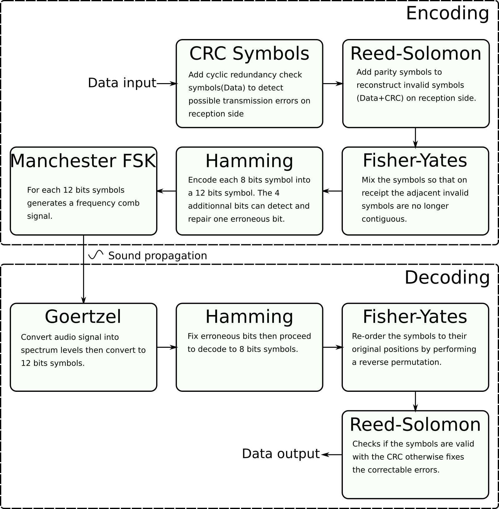

# OpenWarble

Send and receive data using only speaker and microphone.

This library is written in java under BSD 3 license.

Signal processing use method *Sysel and Rajmic:Goertzel algorithm generalized to non-integer multiples of fundamental frequency. EURASIP Journal on Advances in Signal Processing 2012 2012:56.*

# How it works ?

The data transmission method is similar to the first Internet modems except that it is adapted to the disturbances caused by acoustic propagation.

Diagram of the signal modulation and demodulation process:

Here a spectrogram of a sequence:

*Top recorded audio in real situation, bottom source signal.*

This library is full native java and can be included in android app with Api 14+ (Android 4.0.2),it does not require dependencies, the jar size is only 38 kbytes !
