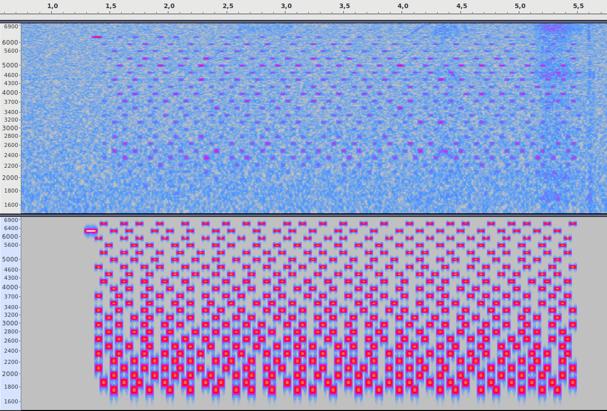

# QRTone

Send and receive data using only speaker and microphone.

Data are converted into dual tone melody.

You can send data to another device a few meters away, depending on the power of the speaker and the sensitivity of the microphone. The transfer rate is about 50 bits per second.

This library is written in java under BSD 3 license.

Signal processing use method *Sysel and Rajmic:Goertzel algorithm generalized to non-integer multiples of fundamental frequency. EURASIP Journal on Advances in Signal Processing 2012 2012:56.*

# How it works ?

The data transmission method is similar to the first Internet modems except that it is adapted to the disturbances caused by acoustic propagation.

Here a spectrogram of a sequence:

*Top source signal, bottom recorded audio in real situation*

QRTone contain a forward correction code in order to reconstruct loss tones.

The reference library **jqrtone** is full native java and can be included in android app with Api 14+ (Android 4.0.2),it does not require dependencies, the jar size is only 40 kbytes !

**cqrtone** is a rewrite using C99 language.
